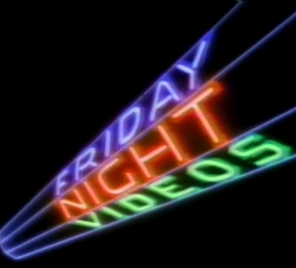

<html lang="en">
<head>
  <meta charset="UTF-8">
  <title>Friday Night Videos Archive</title>
  <link rel="stylesheet" href="assets/css/style.css">
  <meta name="viewport" content="width=device-width, initial-scale=1.0">
</head>

<body>
  <header style="text-align: center; margin-top: 2em;">
    
    <h1>Friday Night Videos Archive</h1>
  </header>

  <section style="max-width: 800px; margin: 2em auto; padding: 0 1em;">
    
<strong>Friday Night Videos</strong> was NBC’s late-night answer to the music video revolution—a weekly showcase of pop, rock, and R&B that aired from 1983 to 2002. Before cable was ubiquitous, this was how millions discovered new artists, watched exclusive performances, and caught glimpses of celebrity hosts in unexpected pairings.

    
This site is an independent preservation effort dedicated to reconstructing the broadcast history of <em>Friday Night Videos</em>. Using verified air dates, segment metadata, and archival research, we aim to document the show’s full run with forensic accuracy. While we do not host recordings, we track their existence where possible to support historical completeness.

    
The archive is continually expanding as more episodes are identified and cataloged.

  </section>

  

    <a href="episodes/" style="
      display: inline-block;
      font-size: 1.5em;
      font-weight: bold;
      padding: 0.75em 1.5em;
      background-color: #222;
      color: #fff;
      text-decoration: none;
      border-radius: 6px;
      transition: background-color 0.3s ease;
    " onmouseover="this.style.backgroundColor='#444'" onmouseout="this.style.backgroundColor='#222'">
      View Episode List
    </a>
  

</body>
</html>